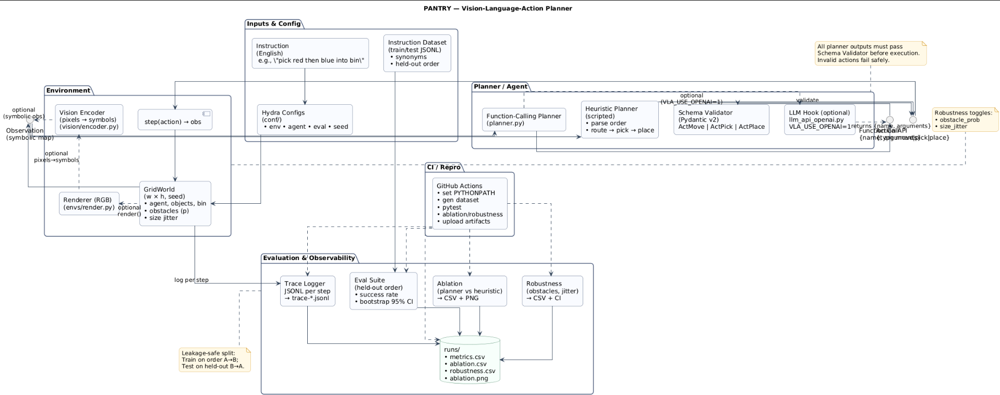

# PANTRY- Vision–Language–Action Planner
## Author: Saidou Diallo
## LinkedIn: https://www.linkedin.com/in/saidoudialloquant/
### PROGRAMS USED
VS Code • Git Bash • GitHub • GitHub Actions • VS Code • PlantUML
### LANGUAGES USED
Python • YAML • Bash • Markdown • UML  
### SKILLS USED
Vision–Language–Action planning • Function-calling orchestration • Schema validation • Experiment design • Leakage-safe evaluation • Bootstrap CIs • Domain randomization • Reproducible engineering (tests/CI)
## SUMMARY
PANTRY is a compact Vision–Language–Action (VLA) framework that turns plain-English instructions (e.g., “pick red then blue into the bin”) into typed, schema-validated actions (`move`, `pick`, `place`) in a symbolic GridWorld “kitchen.” It ships with leakage-safe compositional generalization evaluation (held-out order), robustness sweeps (obstacles, grid size jitter), interpretable traces (JSONL), and reproducible configs/tests/CI. An optional LLM function-calling backend (env-gated) can replace the stub planner while keeping the same safety contract.
I named it “PANTRY” = *Planning Actions from Natural Text for gRidworld* — a kitchen-themed mnemonic for a VLA planner that “stocks” symbolic skills and “serves” them via function calls.
It is for Applied science & robotics teams that need a minimal, auditable VLA stack to evaluate instruction following, planning, and robustness without hardware plus quant-style rigor (leakage controls, CIs, automation).
It Bridges natural language → safe control with a strict schema gate and gives a research-ready harness (held-out compositions, domain randomization, CIs) to measure generalization and stress tolerance — the same experimental discipline you’d want in productionized research.
It is better than using a library or alternatives because:
- Focuses on compositional leakage explicitly (A→B train vs B→A test), not just average reward.  
- Function-calling with Pydantic enforces action contracts so invalid outputs never hit the environment.  
- Reproducibility by default (Hydra configs, unit tests, CI, CSV artifacts, deterministic seeds).  
- Small, readable codebase you can swap/extend: LLM backends, search planners, new skills.

## VALUE PROPOSITION
Safe, auditable language-to-control with strict schema validation and interpretable traces. Research-grade evaluation (compositional split + bootstrap CIs + robustness) in a tiny, reproducible package.
## ARCHITECTURE DIAGRAM

## QUICKSTART (GIT BASH)
### STEP 1 —  Setup
python -m venv .venv
source .venv/Scripts/activate
python -m pip install --upgrade pip
pip install -r requirements.txt
export PYTHONPATH=.
### STEP 2 — Generate dataset & run tests
python -m vla.scripts.gen_dataset
pytest -q
### STEP 3 — Run evaluations
python -m vla.scripts.eval_log
python -m vla.scripts.ablation
python -m vla.scripts.plot_results  # writes runs/ablation.png
python -m vla.scripts.robustness
# Modeling & Methods
PANTRY converts language to actions via a function-calling planner that returns {"name": "...", "arguments": {...}} per step; outputs are validated into typed actions (ActMove|ActPick|ActPlace) with Pydantic before execution.
Evaluation targets compositional generalization: training instructions cover one order (A→B); testing holds out the reverse (B→A) with synonym families to probe structure over memorization.
A vision stub closes the pixels loop (render→encode), while the environment supports obstacles and size jitter for distribution shift.
Metrics are exact sequence success with bootstrap 95% confidence intervals.
# Engineering & Performance
Hydra configs parameterize env/agent/eval; deterministic seeds enable reproducible runs.
Unit tests cover schemas, dataset generation, reward, and env sanity; GitHub Actions sets PYTHONPATH, generates data, runs pytest, ablation, and robustness, then uploads CSVs/plots as artifacts.
Logging supports CSV by default and Weights & Biases optionally; traces are JSONL per episode with a pretty summarizer.
The codebase is small and modular so swapping in an LLM, BFS/A* planner, or new skills is trivial.
# Features
- Strict action contract (function-call → schema-validated action) with safe failure modes.
- Compositional split with synonymized prompts; robustness toggles (obstacle probability, size jitter).
- Ablations & plots out of the box; trace viewer for step-by-step audits.
- LLM hook behind an env flag; defaults to an offline deterministic stub for fully reproducible CI.
